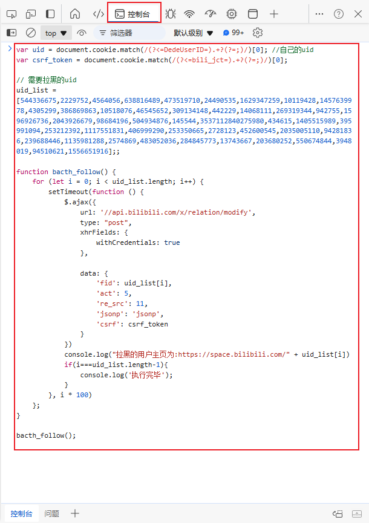
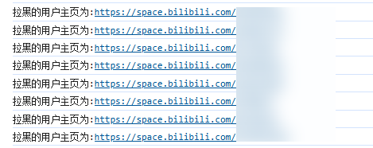

# bilibili-block-users

> 一键批量拉黑B站用户

## 脚本

### 代码
```js
var uid = document.cookie.match(/(?<=DedeUserID=).+?(?=;)/)[0]; //自己的uid
var csrf_token = document.cookie.match(/(?<=bili_jct=).+?(?=;)/)[0];

// 需要拉黑的uid
uid_list = [544336675,2229752,4564056,638816489,473519710,24490535,1629347259,10119428,1457639978,4305299,386869863,10518076,46545652,309134148,442229,14068111,269319344,942755,1596926736,2043926679,98684196,504934876,145544,3537112840275980,434615,1405515989,395991094,253212392,1117551831,406999290,253350665,2728123,452600545,2035005110,94281836,239688446,1135981288,2574869,483052036,284845773,13743667,203680252,550674844,3948019,94510621,1556651916];;

function bacth_follow() {
    for (let i = 0; i < uid_list.length; i++) {
        setTimeout(function () {
            $.ajax({
                url: '//api.bilibili.com/x/relation/modify',
                type: "post",
                xhrFields: {
                    withCredentials: true
                },

                data: {
                    'fid': uid_list[i],
                    'act': 5,
                    're_src': 11,
                    'jsonp': 'jsonp',
                    'csrf': csrf_token
                }
            })
            console.log("拉黑的用户主页为:https://space.bilibili.com/" + uid_list[i])
            if(i===uid_list.length-1){
                console.log('执行完毕');
            }
        }, i * 100)
    };
}

bacth_follow();
```

### 如何使用
1.打开https://space.bilibili.com/，应该跳转到是自己的主页，保持账号登陆状态。


2.打开浏览器控制台
快捷键F12（或者ctrl+shift+i）

3.复制上面的代码，粘贴到控制台


4.回车执行，看到控制台输出“执行完毕”时，表示代码执行完毕。

### 检查是否拉黑成功
在之前的控制台页面，随机点击对应的主页，鼠标右键，点击“在新标签页打开”，跳转到对应UP的主页查看是否拉黑成功。



## 数据来源 
脚本编写思路：
[一个输入uid批量拉黑的脚本](https://www.bilibili.com/read/cv10060036/)

uid数据来源：
如何评价京东在10月23日深夜至10月24日凌晨在B站发动的商单攻势？ - 维维安一般泛用型的回答 - 知乎
https://www.zhihu.com/question/1859720980/answer/13350283685